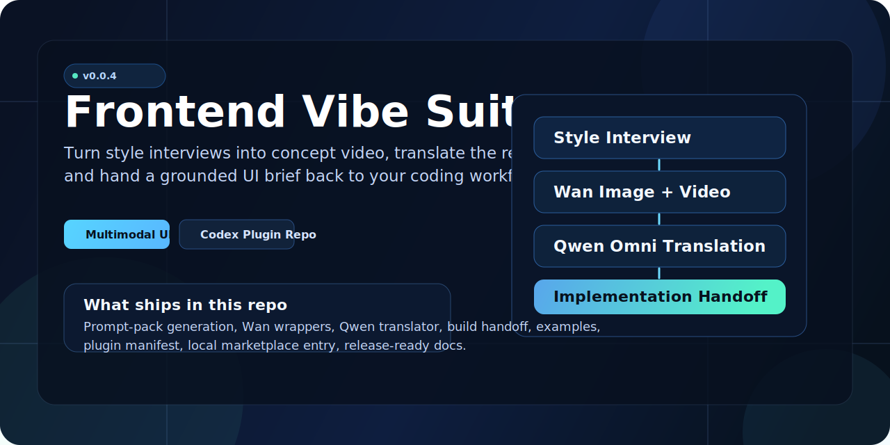

<p align="center">
  
</p>

<p align="center">
  <strong>Multimodal frontend workflow for Codex</strong><br />
  Interview the style. Generate the concept. Translate the video. Build from a grounded UI brief.
</p>

<p align="center">
  
  
  
  
  
</p>

# Frontend Vibe Suite Plugin

`frontend-vibe-suite-plugin` packages a local Codex plugin that inserts a visual prototype loop into frontend vibecoding:

1. run a style interview
2. generate Wan2.7 concept prompts
3. create a short UI showcase video
4. translate that video with Qwen Omni
5. route the stack to the right component family or Web Components system
6. hand a structured brief into normal coding workflows

## Why this exists

Most frontend codegen jumps from a thin request straight into JSX and CSS. This repo adds a visual middle layer so implementation is anchored by:

- a clarified style brief
- a generated visual artifact
- a translated UI brief
- an implementation handoff

That changes the workflow from "guess and build" to "design, read back, then build."

## What ships in `0.0.4`

- `frontend-style-interview` for multi-round style discovery
- `frontend-library-router` for framework and component-family routing
- `select_prompt_template.py` for scenario-aware prompt selection
- `choose_library.py` for machine-readable library routing
- `render_prompt_pack.py` for Wan and Omni prompt generation
- `run_visual_loop.py` for wrapping existing local Wan image and video skills
- `video_to_ui_brief.py` for Qwen Omni video-to-UI translation
- `build_handoff.py` for implementation-ready JSON and Markdown handoff files
- repository CI and Python unit tests
- explicit publisher metadata, runtime contract, and release preflight
- example briefs and example generated artifacts
- local marketplace metadata for Codex plugin loading
- a stack-aware component routing guide for Vue, Svelte, Angular, Solid, React, and Web Components
- a scenario-aware prompt system covering at least 20 frontend situations

## Library Routing

This repo keeps the stack choice explicit instead of forcing one UI kit.

- React headless: `React Aria`, `Radix UI`, `Headless UI`
- React source-first: `shadcn/ui`
- React suites: `MUI`, `Ant Design`, `Chakra UI`, `Mantine`, `PrimeReact`
- Vue suites: `PrimeVue`, `Quasar`, `Element Plus`, `Naive UI`, `Vuetify`
- Angular: `PrimeNG`, `Ionic`
- Svelte: `Bits UI`, `Melt UI`
- cross-framework behavior: `Zag.js`, `Ark UI`
- portable Web Components: `Lit`, `Shoelace`, `Stencil`, `FAST`, `Fluent UI Web Components`, `Spectrum Web Components`, `Carbon Web Components`, `Vaadin`, `Material Web`
- Tailwind-only layer: `DaisyUI`

See the full matrix in [plugins/frontend-vibe-suite/docs/component-library-routing.md](./plugins/frontend-vibe-suite/docs/component-library-routing.md).

## Publishing and Runtime Transparency

This repo now carries explicit publisher and runtime metadata instead of burying release assumptions in ad hoc notes.

- publisher contract: [plugins/frontend-vibe-suite/docs/publisher-adaptation-and-tags.md](./plugins/frontend-vibe-suite/docs/publisher-adaptation-and-tags.md)
- publisher metadata: [plugins/frontend-vibe-suite/data/publisher-metadata.json](./plugins/frontend-vibe-suite/data/publisher-metadata.json)
- runtime contract: [plugins/frontend-vibe-suite/docs/security-and-runtime.md](./plugins/frontend-vibe-suite/docs/security-and-runtime.md)
- release preflight: [plugins/frontend-vibe-suite/scripts/release_preflight.py](./plugins/frontend-vibe-suite/scripts/release_preflight.py)
- reproducible publish command: [plugins/frontend-vibe-suite/scripts/render_publish_command.py](./plugins/frontend-vibe-suite/scripts/render_publish_command.py)

The current release policy is explicit about:

- required environment variables
- standard-library-only Python scripts
- expected network targets
- subprocess usage
- bundle host targets and adaptation caveats
- plugin-local Wan wrappers instead of home-directory skill invocations

## Repository Layout

```text
.
├── .agents/plugins/marketplace.json
├── assets/
│   └── frontend-vibe-suite-hero.svg
├── plugins/
│   └── frontend-vibe-suite/
│       ├── data/
│       │   └── component-libraries.json
│       │   └── prompt-scenarios.json
│       ├── docs/
│       │   └── component-library-routing.md
│       ├── .codex-plugin/plugin.json
│       ├── skills/
│       ├── scripts/
│       ├── examples/
│       └── README.md
├── CHANGELOG.md
├── LICENSE
└── README.md
```

## Configuration

Required:

- `DASHSCOPE_API_KEY`

Optional:

- `DASHSCOPE_BASE_URL`
- `QWEN_OMNI_MODEL`

Template env file:

- `plugins/frontend-vibe-suite/.env.example`

## Limits in `0.0.1`

- video translation still expects a public `video_url`
- the Wan wrapper reuses existing local Wan skills instead of shipping its own SDK client
- implementation ends at handoff generation, not automatic code patching
- the target framework and component system should still be provided in the style brief when you want stack-specific output

## Use

Read [plugins/frontend-vibe-suite/README.md](./plugins/frontend-vibe-suite/README.md) for the operational workflow and command examples.
Read [plugins/frontend-vibe-suite/docs/component-library-routing.md](./plugins/frontend-vibe-suite/docs/component-library-routing.md) for the routing matrix.

## Publish to GitHub

This repository is already initialized locally on branch `main`.

```bash
cd /Users/kkellyoffical/frontend-vibe-suite-plugin
git remote add origin <your-github-repo-url>
git push -u origin main --tags
```

## License

MIT
